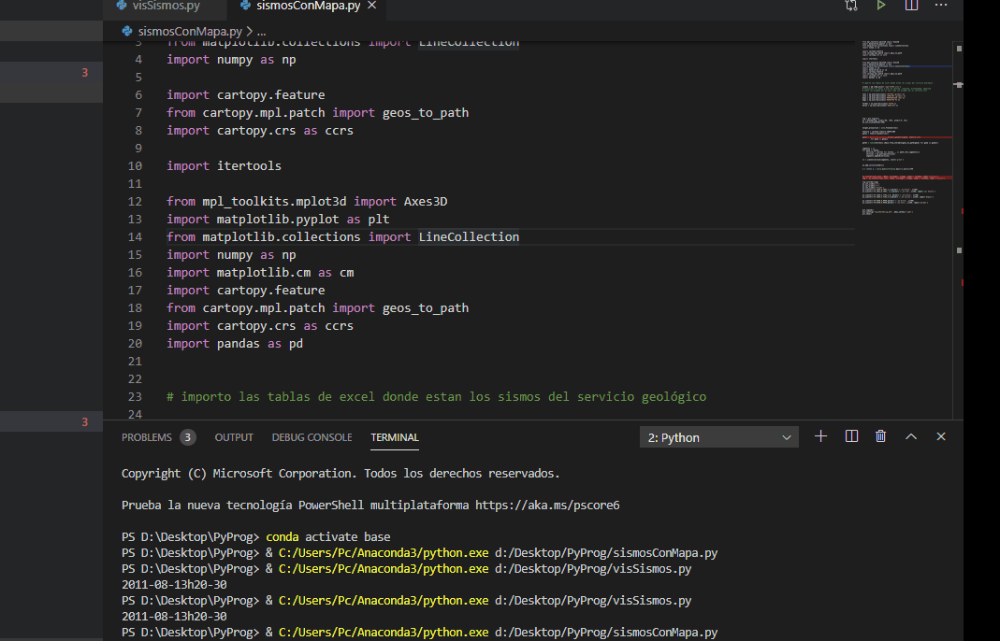

# Sismología
**Visualización Sismos usando cartopy y matplotlib en Colombia**

Se utiliza Cartopy y Matplotlib, se adjunta además los datos usados en la tabla de excel, a menos que se especifique, esta debe estar en la 
misma carpeta que el codigo (.py)

